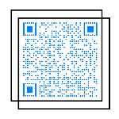
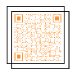
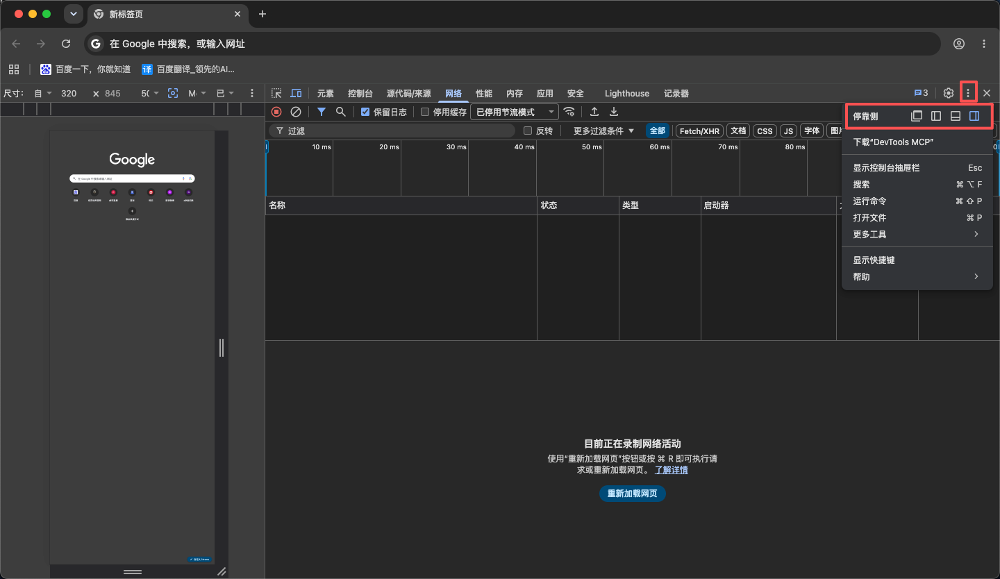
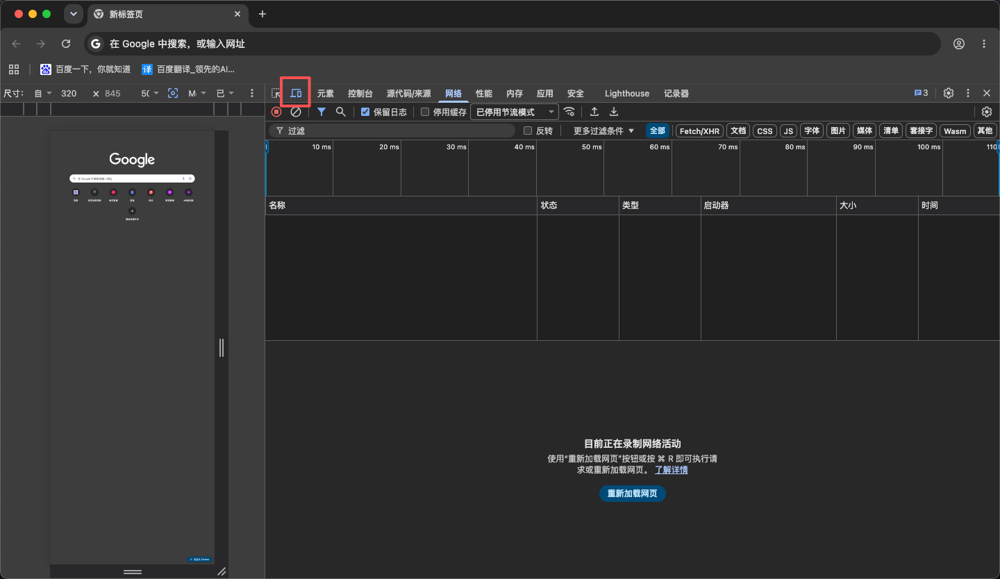

# 团团校园社交 · 校园社区小程序（School Circle）


**English:** [README_EN.md](README_EN.md)

**面向高校的校园社交 / 校园社区开源解决方案。** 支持校园动态、校园圈子、课程表管理、玩伴匹配、校园身份认证等核心功能，帮助校园运营者快速搭建专属的校园社交平台（校园 SNS）。

> 全套方案包含：本前端（微信小程序 + H5）+ [后端服务（Spring Boot）](https://github.com/xiaotuantuankeji/school-circle-server)（Gitee 镜像：[school-circle-server](https://gitee.com/nanjing-xiaotuantuan-group/school-circle-server)）。

## 功能特性

- 🏫 **校园动态 / 校园圈子**：发布动态、浏览校园新鲜事、校园广场
- 📚 **课程表管理**：按学期维护课程，支持周次/节次视图
- 🤝 **玩伴匹配**：基于兴趣与标签的校园社交匹配功能
- 🎓 **校园身份认证**：学生身份认证与审核流程
- 📱 **多端运行**：一套代码，同时编译为微信小程序、H5
- 🧩 **组件化开发**：基于 uni-app 的组件化架构，易于扩展二次开发

## 技术栈

| 分类 | 技术 |
|------|------|
| 框架 | uni-app（Vue 2 + TypeScript） |
| 平台 | 微信小程序 / H5 |
| 构建工具 | HBuilderX / Vue CLI |
| 代码规范 | ESLint + Prettier |

## 快速上手

### 通过 HBuilderX 可视化界面（推荐）

1. 下载安装 [HBuilderX](https://www.dcloud.io/hbuilderx.html)（App 开发版）
2. 导入项目，选择 `school-circle-mini` 目录
3. 配置微信小程序 AppID
4. 运行到微信小程序

### 通过 CLI

```bash
# 安装依赖
npm install

# 代码检查
npm run lint

# 代码格式化
npm run format

# 类型检查
npm run typecheck
```

## 项目结构

```
school-circle-mini/
├── api/                   # API 接口层
├── common/                # 公共工具库
├── components/            # 公共组件
├── libs/                  # 基础库（WebSocket、微信授权等）
├── pages/                 # 主页面
├── package-account/       # 账号管理分包
├── package-agreement/     # 协议分包
├── package-content/       # 内容分包
├── package-course/        # 课程表分包
├── package-playmate/      # 玩伴功能分包
├── package-user/          # 用户分包
├── package-verify/        # 认证审核分包
├── static/                # 静态资源
├── types/                 # TypeScript 类型定义
├── uni_modules/           # uni-app 插件模块
├── App.vue                # 应用入口
└── main.js                # 主入口
```

## 配置说明

项目开源后已移除敏感信息，使用项目前需要修改以下配置：

| 配置项 | 文件 | 说明 |
|--------|------|------|
| 微信小程序 AppID | `manifest.json` | 将 `mp-weixin.appid` 替换为你的微信小程序 AppID |
| 开发服务器地址 | `common/config.ts` | 将 `XXX.XXX.XXX.XXX:XXXXX` 替换为实际的开发环境服务器地址和端口 |
| 生产服务器地址 | `common/config.ts` | 将 `XXX.XXX.XXX.XXX:XXXXX` 替换为实际的生产环境域名和端口 |
| 学校默认图标 | `pages/chooseschool/chooseschool.vue` | 将 `schoolIcon` 替换为实际的学校图标资源路径 |

## 在线演示

### 管理平台



- 演示地址：`https://ky.xiaotuantuan.com.cn/schoolAdmin/`
- 账号：`demoAdmin` 密码：`demo@2026`

### 小程序 H5



- 演示地址：`https://ky.xiaotuantuan.com.cn/schoolWeb/`
- 账号：自行注册

#### PC 浏览器查看 H5 演示（手机端模式）

> H5 页面按手机端布局设计，直接使用 PC 浏览器打开会以宽屏拉伸显示、效果较差。请在 PC 浏览器中开启"设备模拟 / 手机端视图"后再访问，即可获得与手机一致的浏览体验：

**Chrome / Edge（推荐）**

1. 按 `F12` 打开开发者工具（或右键页面 → **检查**）；
2. （可选）调整**开发者工具停靠位置**：点击开发者工具右上角的 **⋮（更多选项）** → **停靠位置（Dock side）**，可选择停靠右侧、停靠底部或独立窗口（快捷键 `Ctrl+Shift+D`，Mac 为 `Cmd+Shift+D`），避免工具面板遮挡页面，方便对照查看；

3. 点击开发者工具左上角的**"设备切换"图标**（手机+平板样式），或按快捷键 `Ctrl+Shift+M`（Mac 为 `Cmd+Shift+M`）；

4. 在顶部设备下拉框中选择手机型号（如 iPhone 12/13/14、Pixel 等），或选择 `Responsive` 后将宽度手动调整为 `375px`（iPhone 常见宽度）；
5. **刷新页面**，即可按手机端效果浏览演示。

**360 安全浏览器 / 360 极速浏览器**

1. 先在地址栏右侧将内核切换为**极速模式**（Chromium 内核），兼容模式下不支持设备模拟；
2. 按 `F12` 打开开发者工具（或菜单 **工具 → 开发者工具**）；
3. 点击开发者工具左上角的**"设备切换"图标**（手机+平板样式），或按快捷键 `Ctrl+Shift+M`；
4. 在顶部设备下拉框中选择手机型号（如 iPhone、常见安卓机型），或选择 `Responsive` 后将宽度调整为 `375px`；
5. **刷新页面**，即可按手机端效果浏览演示。

**Safari**

1. 菜单栏 **Safari → 设置（偏好设置）→ 高级**，勾选"**在菜单栏中显示'开发'菜单**"；
2. 点击菜单栏 **开发 → 进入响应式设计模式**（快捷键 `Option + Cmd + R`）；
3. 在顶部选择设备型号后刷新页面即可。

## 适用场景

- 高校学生会 / 校园社区运营团队快速搭建校园社交平台
- 需要课程表、校园动态、校园认证一体化方案的技术团队
- uni-app 校园类小程序二次开发的学习参考项目

## 相关仓库

- 前端（本仓库）：[school-circle-mini](https://github.com/xiaotuantuankeji/school-circle-mini)
- 后端：[school-circle-server](https://github.com/xiaotuantuankeji/school-circle-server)（Gitee：[镜像](https://gitee.com/nanjing-xiaotuantuan-group/school-circle-server)）

## 商用联系

QQ群：1087277252

## 许可证

本项目基于 [Apache License 2.0](LICENSE) 开源。

Copyright &copy; 2026 南京校团团科技有限公司
